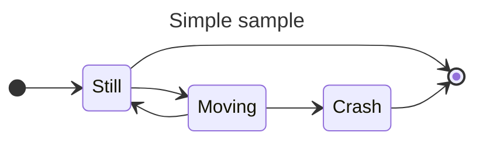

# Random stuff to be fixed

La `subshell` como equivalente a la oración subordinada, apuntará a un
isomorfismo en tonalidad poética?

```plaintext
Mi memoras,
    ke vi diris al mi
        ke via amiko diris al vi,
            ke li kredas,
                ke mi gajnos premion,
                    kiam la bovino flugis.
```

_For Haskell so loved the `world -> (a, world)` that it gave us the
`IO Monad`, that whosoever composes with it should not be impure,
but free of side effects._

## Diagram



The conclusion: $\Diamond aPx \rightarrow \Box bQy$

$$
\begin{aligned}
    f(x) &= x^2 \\
    g(x) &= \frac{1}{x} \\
    F(x) &= \int^a_b \frac{1}{3}x^3
\end{aligned}
$$

## Image


